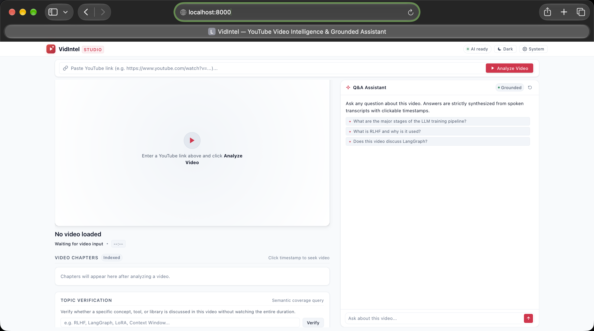
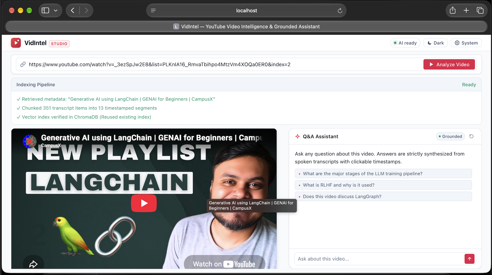
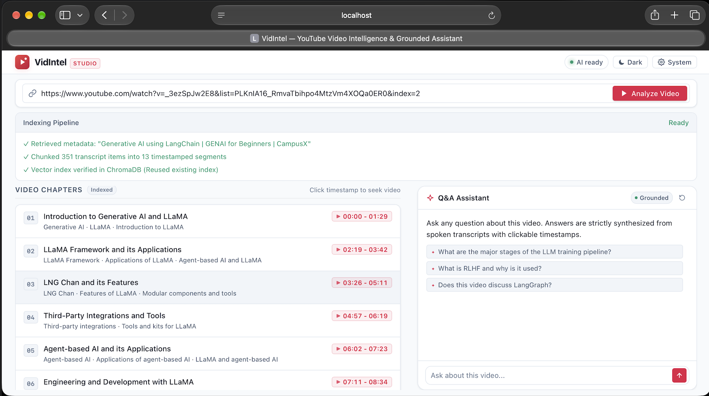
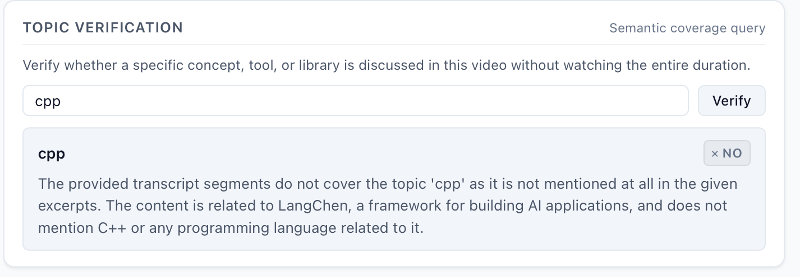
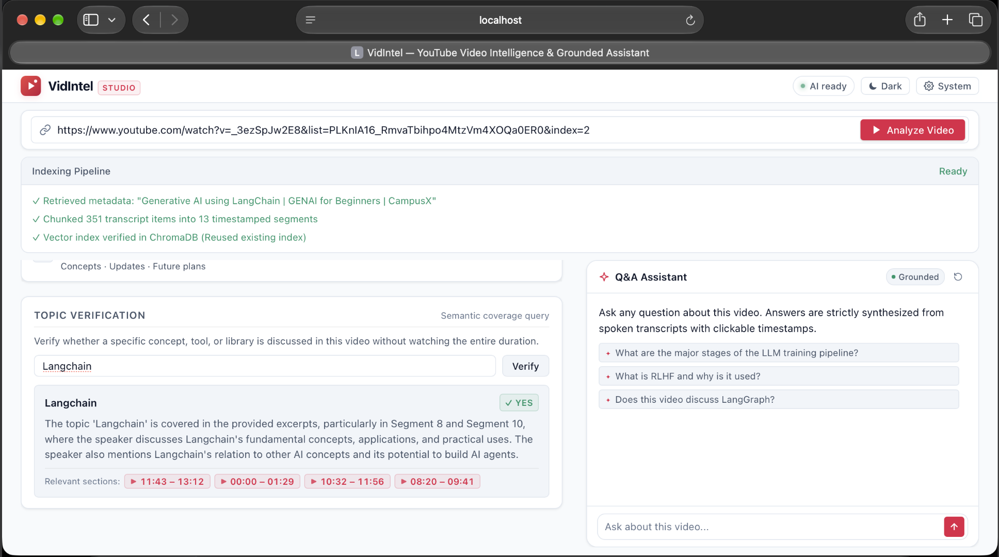
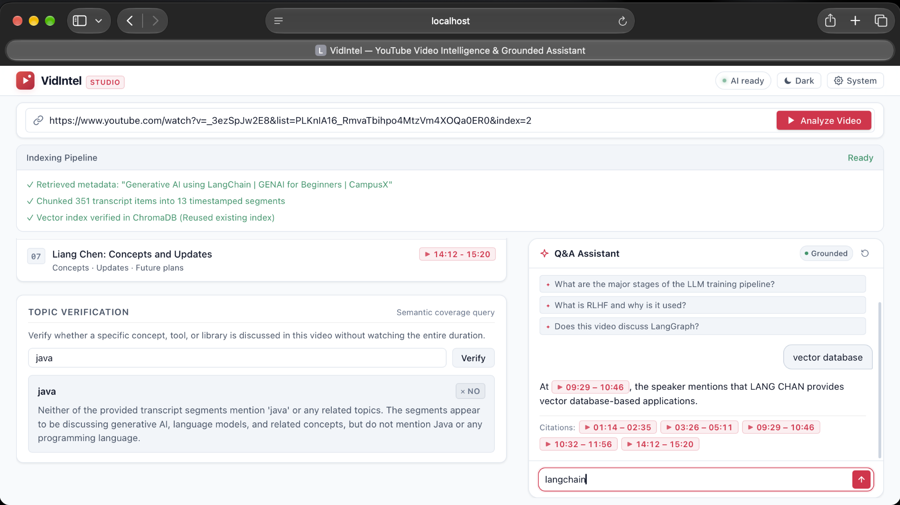

# VidIntel — YouTube Video Intelligence & Grounded Q&A Assistant 🎥 🧠

> A production-grade, privacy-first Video Intelligence platform that ingests YouTube videos, parses timestamped transcripts, executes semantic vector search via ChromaDB, extracts structured chapters, and answers questions with precise timestamp references using local open-source LLMs while strictly preventing hallucinations.

---

## 📸 Interface Preview & Demo

### 🎬 Screen Recording Walkthrough
Watch VidIntel in action—analyzing a video, seeking via timestamps, and executing grounded RAG Q&A:

<p align="center">
  <video src="Screen%20Recording/demo.mp4" controls width="100%" poster="Screenshot/1.png">
    Your browser does not support the video tag.
  </video>
</p>

### 🖼️ Screenshots & Feature Walkthrough

| **1. Main Interface & Split View** | **2. Grounded Q&A Assistant** |
| :---: | :---: |
|  |  |
| *Fixed app-shell with independent left-scroll & stationary Q&A* | *Answers strictly synthesized with clickable timestamp citations* |

| **3. Structured Video Chapters** | **4. Topic Presence Verification** |
| :---: | :---: |
|  |  |
| *Automated chapter breakdown with subtopics & jump links* | *Instant semantic verification (YES / NO / PARTIALLY)* |

| **5. Light & Dark Themes** | **6. System Architecture & Model Runtime** |
| :---: | :---: |
|  |  |
| *High-contrast editorial dark and clean light modes* | *Local Ollama + MPS Apple Metal hardware acceleration* |

---

## ✨ Features & Capabilities

- ⏱️ **Timestamp-Preserving Semantic Chunking**: Unlike naive text splitters that lose time coordinates, our sliding-window chunker preserves exact millisecond start and end boundaries (`start_time`, `end_time`, `start_timestamp`, `end_timestamp`) for every chunk.
- 🛡️ **Strict Anti-Hallucination RAG**: The language model is strictly bound to retrieved transcript excerpts. If a concept is not spoken in the video, it explicitly flags that the topic was not found rather than fabricating answers.
- 🎯 **Zero-Shot Topic Presence Verification**: Query whether a specific tool or concept (*"Does this video cover LangGraph / RLHF?"*) is discussed without watching the entire video. Returns **YES / NO / PARTIALLY** with direct seek links.
- 📑 **Automated Chapter & Subtopic Indexing**: Automatically structures videos into sequential chapters with clean titles, subconcept tags, and time bounds.
- ⏯️ **Interactive Video Player Synchronization**: Clicking any timestamp citation (e.g. `▶ 12:34`) immediately commands the embedded YouTube player to seek and start playback from that exact second.
- ⚡ **100% Local & Free Inference**: Powered by `BAAI/bge-small-en-v1.5` (accelerated via Apple Silicon Metal / `mps` or CUDA) and `llama3.2:3b` via Ollama. Zero cloud API costs and complete data privacy.
- 🖥️ **Editorial SaaS Split-View Interface**: Features a fixed app-shell split layout where the media and chapters scroll independently while the Q&A Assistant stays stationary, complete with instant light/dark mode switching.
- 💾 **Deduplication Engineering**: Videos are vectorized once in ChromaDB; subsequent queries reuse existing vector indexes to avoid redundant processing.

---

## 🏗️ Architecture Flow

```
                 YouTube Video URL
                         │
                         ▼
        ┌──────────────────────────────────┐
        │  Transcript & Metadata Extractor │ (Preserves start, duration, end timestamps)
        └────────────────┬─────────────────┘
                         │
                         ▼
        ┌──────────────────────────────────┐
        │  Timestamp-Preserving Chunker    │ (Sliding window with boundary preservation)
        └────────────────┬─────────────────┘
                         │
                         ▼
        ┌──────────────────────────────────┐
        │    BAAI/bge-small-en-v1.5        │ (Hardware accelerated: Metal/MPS on Mac, CUDA on Linux)
        └────────────────┬─────────────────┘
                         │
                         ▼
        ┌──────────────────────────────────┐
        │    ChromaDB Persistent Store     │ (Scoped vector search with timestamp metadata)
        └────────────────┬─────────────────┘
                         │
           ┌─────────────┴─────────────┐
           ▼                           ▼
  [ Grounded Q&A Assistant ]   [ Topic Presence Checker ]
           │                           │
           ▼                           ▼
   Anti-Hallucination          Semantic Retrieval +
   Strict Context Prompt       LLM Verification
           │                           │
           ▼                           ▼
  Grounded Answer +           YES / NO / PARTIALLY +
  Interactive [▶ MM:SS]       Direct Video Jump Timestamps
```

---

## 🛠️ Tech Stack

| Component | Technology | Purpose |
| :--- | :--- | :--- |
| **Backend Framework** | FastAPI & Uvicorn | High-throughput asynchronous REST API |
| **Embedding Model** | `BAAI/bge-small-en-v1.5` | 384-dim dense vectors on Apple Metal (`mps`) / CUDA |
| **Vector Database** | ChromaDB | Persistent local vector store (`./data/chroma_db`) |
| **Generation LLM** | Ollama (`llama3.2:3b`) | Local inference at `temperature=0.1` for grounded synthesis |
| **Relational Database** | SQLAlchemy & SQLite / PostgreSQL | Chat history sessions, video metadata, and topic records |
| **Media Ingestion** | `yt-dlp` & `youtube-transcript-api` | Video metadata and timestamped caption download |
| **Frontend UI** | HTML5, Modern CSS, Vanilla JS | Fixed app-shell split view with YouTube IFrame API |
| **Containerization** | Docker & Docker Compose | Multi-container deployment (FastAPI + PostgreSQL) |

---

## ⚡ Quickstart Guide

### 1. Prerequisites
- Python 3.11+
- [Ollama](https://ollama.com/) installed and running locally

### 2. Pull the Open-Source LLM
In a terminal window:
```bash
ollama serve
ollama pull llama3.2:3b
```

### 3. Clone & Setup Python Virtual Environment
```bash
# Clone the repository
git clone https://github.com/your-username/youtube-video-intelligence.git
cd youtube-video-intelligence

# Create and activate virtual environment
python3 -m venv .venv
source .venv/bin/activate

# Install dependencies
pip install -r requirements.txt
```

### 4. Run the Application
```bash
# Start FastAPI backend with hot-reload
uvicorn backend.app.main:app --reload --port 8000
```

Open your browser at **[http://localhost:8000](http://localhost:8000)**!  
Interactive OpenAPI documentation is available at **[http://localhost:8000/docs](http://localhost:8000/docs)**.

---

## 🧪 Testing & Benchmarks

### Run Automated Unit & API Tests:
```bash
.venv/bin/pytest backend/tests/ -v
```

### Run Embedding Model Benchmark:
Evaluates Recall@K, MRR, and embedding query latency on real video transcripts:
```bash
.venv/bin/python benchmark/run_embedding_benchmark.py
```

### Run LLM Anti-Hallucination Benchmark:
Evaluates answer grounding and resistance against fabricated out-of-domain questions:
```bash
.venv/bin/python benchmark/run_llm_benchmark.py
```

---

## 🐳 Docker Deployment

To launch the full production stack with FastAPI and PostgreSQL:
```bash
docker compose up --build
```
The application will be accessible at `http://localhost:8000` with PostgreSQL connected on port `5432`.

---

## 📂 Project Structure

```
.
├── backend/
│   ├── app/
│   │   ├── main.py            # FastAPI application & static mount
│   │   ├── core/config.py     # Pydantic Settings
│   │   ├── api/routes.py      # REST API endpoints (/process, /ask, /check-topic)
│   │   ├── models/schemas.py  # Pydantic schemas
│   │   ├── db/                # SQLAlchemy database models & session
│   │   └── services/          # Chunker, Embedder, Vector Store, LLM, RAG
│   └── tests/                 # 18 passing unit & API tests
├── frontend/
│   ├── index.html             # Fixed app-shell layout (split-scroll)
│   ├── css/style.css          # Editorial SaaS stylesheet (dark & light theme)
│   └── js/app.js              # State management & YouTube IFrame API
├── benchmark/                 # Embedding and LLM benchmark scripts
├── Dockerfile                 # Multi-stage production container
├── docker-compose.yml         # Container orchestration
└── requirements.txt           # Pinned dependencies
```

---

## 📄 License
MIT License. Free for personal and commercial use.
